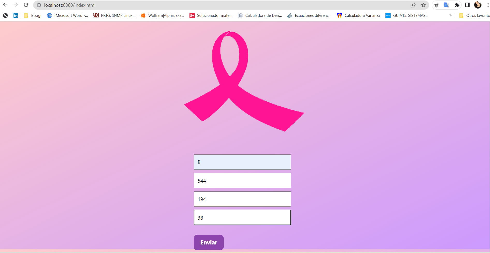
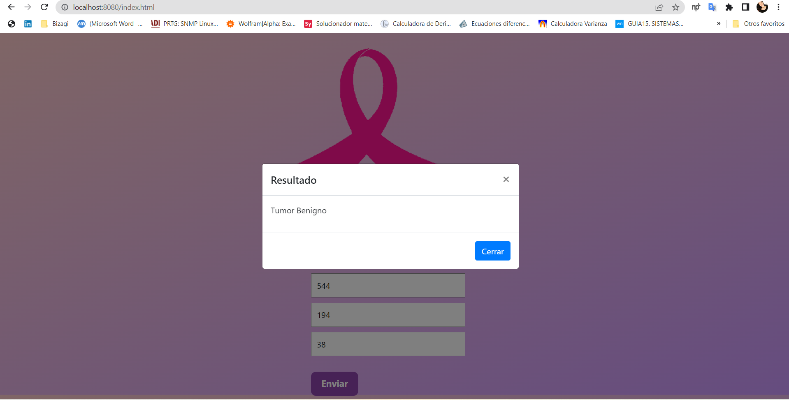
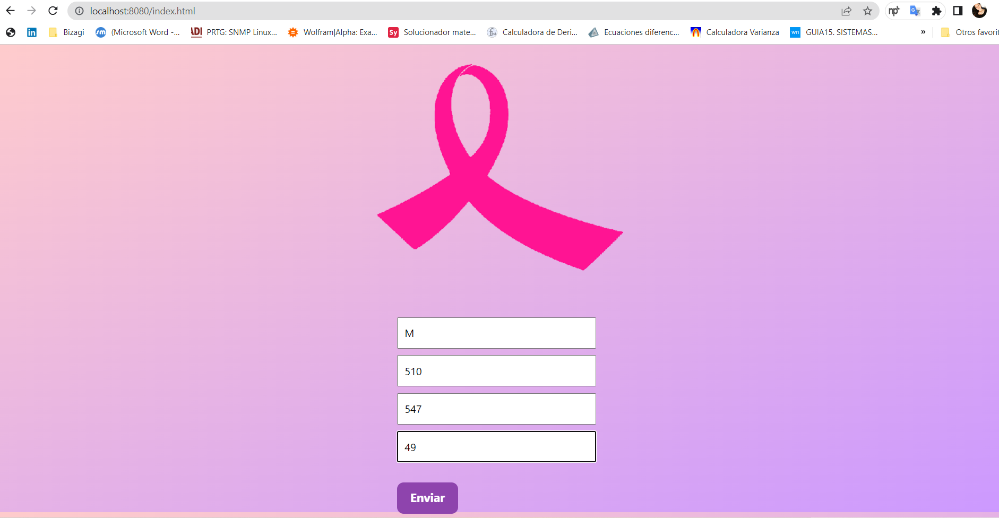
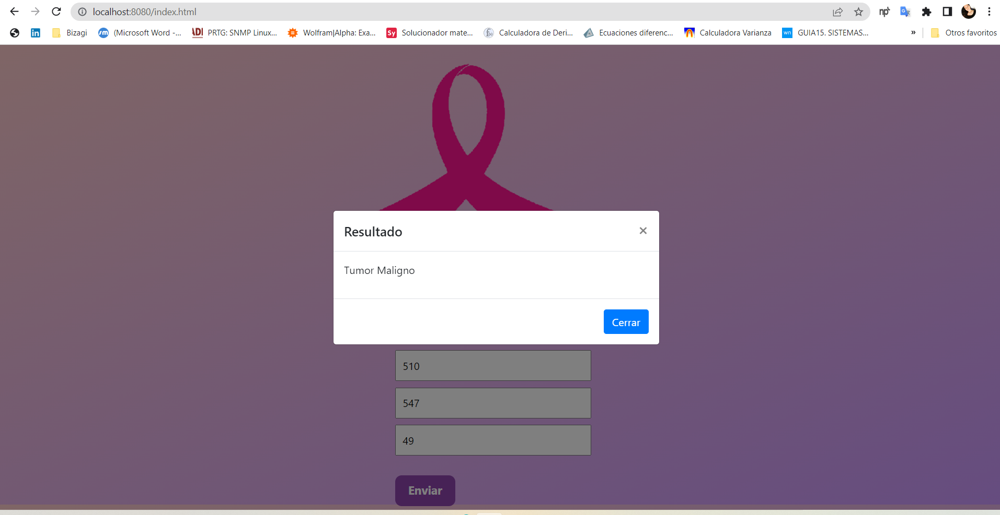
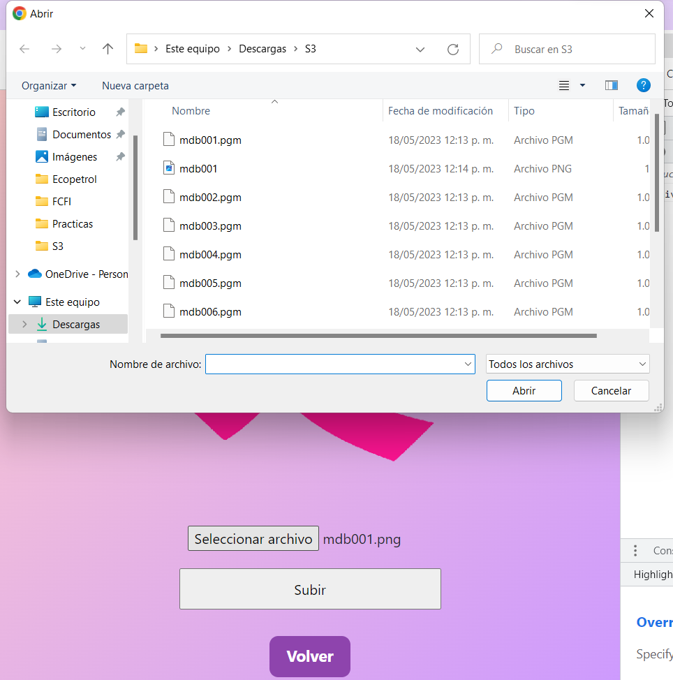
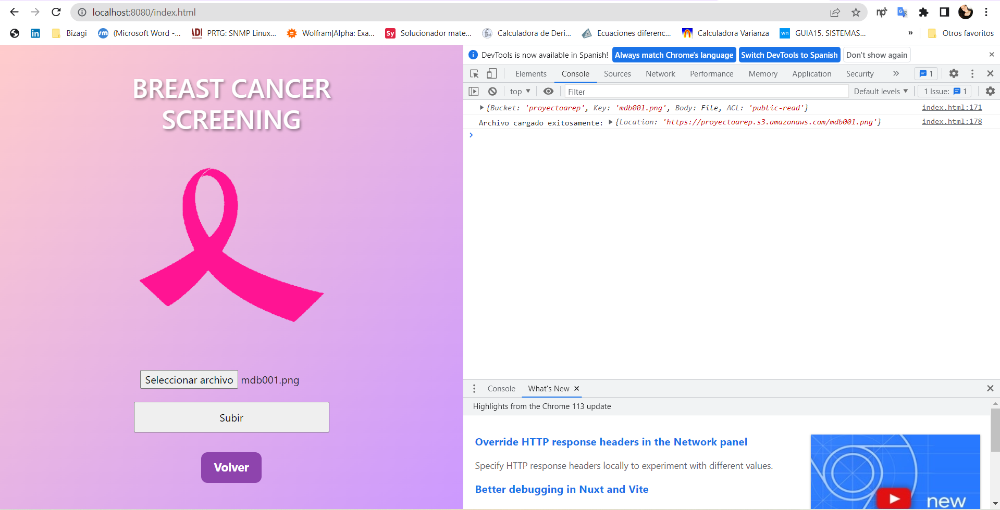
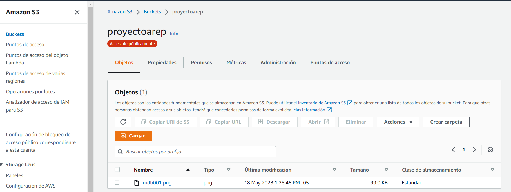

# Detección Temprana de Cáncer de mama Mediante Uso de Aplicativos IA

### Intregantes:

* Daniela Garcia Romero
* Hayden Esteban Cristancho Pinzon
* Gabriela Castro Santamaria

## Descripción Básica

## Implementación

### Parte 1 Java

Para la primera parte practica se implemento una aplicación donde el usuario pueda cargar el resultado obtenido en su examen para poder ser analizados. Estos datos son: la severidad, el radio y las coordenadas x y y, tomando estos datos, el sistema da como resultado si el tumor es maligno o beningno. Es importante aclarar que en este punto no se hace uso de inteligencia artificial pero se busca recrear gran parte de la idea central del proyecto.

* En este caso se ingresaron los datos de un tumor que es benigno.

* El sistema da un resultado satisfactorio.

* Para este caso se ingresaron los datos de un tumor que es maligno.

* El sistema da un resultado satisfactorio.

